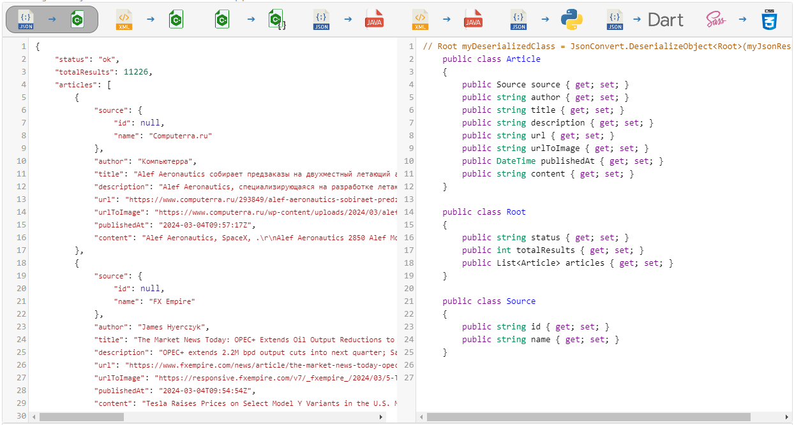

### OakMvc .Net 8.0 - NewsApi Global

## Used Packages
Packages can be installed from the "[NuGet Gallery](https://www.nuget.org/packages/Microsoft.AspNet.Identity.Core)" with the help of the `Tools > NuGet Package Manager > Package Manager Console`.

- [Newtonsoft.Json 13.0.3](https://www.nuget.org/packages/Newtonsoft.Json/13.0.3)
```
    PM> NuGet\Install-Package Newtonsoft.Json -Version 13.0.3
```

[https://newsapi.org/](https://newsapi.org/)
[https://json2csharp.com/](https://json2csharp.com/)

<br />

