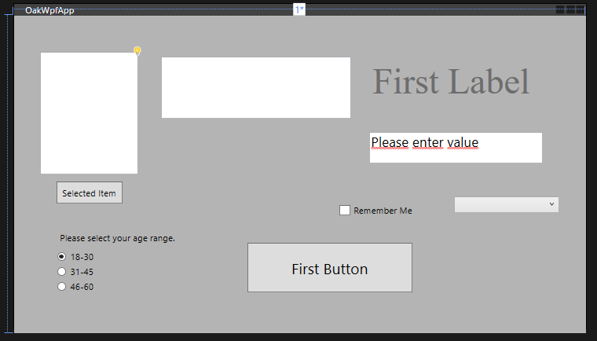

## WPF Basic Tools



```xml
<Window x:Name="WinMain" x:Class="OakWpfApp.MainWindow"
        xmlns="http://schemas.microsoft.com/winfx/2006/xaml/presentation"
        xmlns:x="http://schemas.microsoft.com/winfx/2006/xaml"
        xmlns:d="http://schemas.microsoft.com/expression/blend/2008"
        xmlns:mc="http://schemas.openxmlformats.org/markup-compatibility/2006"
        xmlns:local="clr-namespace:OakWpfApp"
        mc:Ignorable="d"
        Title="OakWpfApp" Height="432" Width="761" Loaded="OakWpfApp_Loaded">
    <Grid x:Name="firstgrid" Margin="0,0,0,-6">
        <Grid.Background>
            <SolidColorBrush Color="#FFB4B4B4"/>
        </Grid.Background>
        <Grid.ColumnDefinitions>
            <ColumnDefinition/>
        </Grid.ColumnDefinitions>
        <Button x:Name="btnFirst" Content="First Button" HorizontalAlignment="Left" Margin="310,302,0,0" VerticalAlignment="Top" FontSize="20" Height="66" Width="220" Click="btnFirst_Click"/>
        <Label x:Name="lblFirst" Content="First Label" Margin="472,54,0,0" VerticalAlignment="Top" Height="66" Width="253" FontSize="48" FontFamily="Times New Roman" IsEnabled="False" HorizontalAlignment="Left"/>
        <TextBox x:Name="txtFirst" HorizontalAlignment="Left" SpellCheck.IsEnabled="True" Margin="472,154,0,0" TextWrapping="Wrap" Text="Please enter value" VerticalAlignment="Top" Width="231" Height="42" FontSize="18" AcceptsReturn="True" TextChanged="txtFirst_TextChanged" SelectionChanged="txtFirst_SelectionChanged"/>
        <TextBox x:Name="txtSecond" HorizontalAlignment="Left" Margin="195,54,0,0" TextWrapping="Wrap" VerticalAlignment="Top" Width="253" Height="83" AcceptsReturn="True"/>
        <CheckBox x:Name="chkFirst" Content="Remember Me" HorizontalAlignment="Left" Margin="432,251,0,0" VerticalAlignment="Top" Checked="chkFirst_Checked" Unchecked="chkFirst_Unchecked" RenderTransformOrigin="0.552,-11.892"/>
        <Label Content="Please select your age range." HorizontalAlignment="Left" Margin="56,282,0,0" VerticalAlignment="Top"/>
        <RadioButton x:Name="rbFirst" GroupName="Age" Content="18-30" HorizontalAlignment="Left" Margin="56,313,0,0" VerticalAlignment="Top" IsChecked="True"/>
        <RadioButton x:Name="rbSecond" GroupName="Age" Content="31-45" HorizontalAlignment="Left" Margin="56,333,0,0" VerticalAlignment="Top"/>
        <RadioButton x:Name="rbThird" GroupName="Age" Content="46-60" HorizontalAlignment="Left" Margin="56,353,0,0" VerticalAlignment="Top"/>
        <ComboBox x:Name="cmbFirst" HorizontalAlignment="Left" Margin="585,240,0,0" VerticalAlignment="Top" Width="140" SelectionChanged="cmbFirst_SelectionChanged">
        </ComboBox>
        <ListBox x:Name="lbFirst" Margin="35,48,596,211" SelectionMode="Multiple">
            <ListBox.ItemTemplate>
                <DataTemplate>
                    <StackPanel>
                        <TextBlock Text="{Binding Name}"/>
                    </StackPanel>
                </DataTemplate>
            </ListBox.ItemTemplate>
        </ListBox>
        <Button x:Name="btnListBox" Content="Selected Item" HorizontalAlignment="Left" Margin="56,220,0,0" VerticalAlignment="Top" RenderTransformOrigin="-3.318,0.596" Height="30" Width="88" Click="btnListBox_Click"/>
    </Grid>
</Window>
```