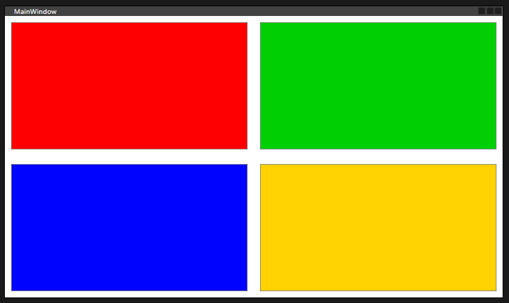

### Canvas



```xml
    <Canvas>
        <Button Content="" Canvas.Left="10" Canvas.Top="10" Height="210" Width="390" Background="Red" HorizontalAlignment="Left" VerticalAlignment="Center"/>
        <Button Content="" Canvas.Right="10" Canvas.Top="10" RenderTransformOrigin="0.034,-0.635" Height="210" Width="390" HorizontalAlignment="Left" VerticalAlignment="Center" Background="#FF00D003"/>
        <Button Content="" Canvas.Left="10" Canvas.Bottom="10" Height="210" Width="390" HorizontalAlignment="Center" VerticalAlignment="Top" Background="#FF0004FF"/>
        <Button Content="" Canvas.Right="10" Canvas.Bottom="10" RenderTransformOrigin="2.334,-0.951" HorizontalAlignment="Center" VerticalAlignment="Top" Height="210" Width="390" Background="#FFFFD200"/>
    </Canvas>
```