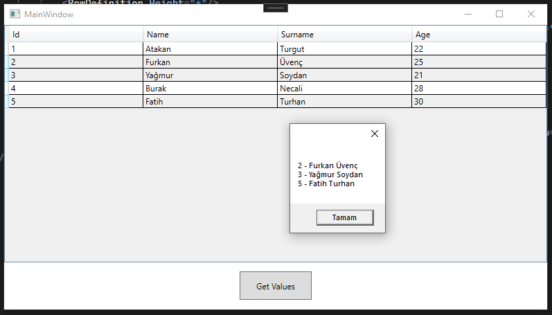

## Data Grid



```xml
    <Grid>
        <Grid.RowDefinitions>
            <RowDefinition Height="5*"/>
            <RowDefinition Height="*"/>
        </Grid.RowDefinitions>
        <DataGrid x:Name="dataGrid" AutoGenerateColumns="False" IsReadOnly="True" SelectionMode="Extended">
            <DataGrid.Columns>
                <DataGridTextColumn Header="Id" Width="*" Binding="{Binding Id}"/>
                <DataGridTextColumn Header="Name" Width="*" Binding="{Binding Name}"/>
                <DataGridTextColumn Header="Surname" Width="*" Binding="{Binding Surname}"/>
                <DataGridTextColumn Header="Age" Width="*" Binding="{Binding Age}"/>
            </DataGrid.Columns>
        </DataGrid>
        <Button x:Name="btnGetValues" Content="Get Values" HorizontalAlignment="Center" Grid.Row="1" VerticalAlignment="Center" Height="41" Width="104" Click="btnGetValues_Click"/>
    </Grid>
```

```xml
Basic:
    <Grid>
        <Grid.RowDefinitions>
            <RowDefinition Height="5*"/>
            <RowDefinition Height="*"/>
        </Grid.RowDefinitions>
        <DataGrid x:Name="dataGrid" d:ItemsSource="{d:SampleData ItemCount=5}">
            <DataGrid.Columns>
                <DataGridTextColumn Header="First" Width="*"/>
                <DataGridTextColumn Header="Second" Width="*"/>
            </DataGrid.Columns>
        </DataGrid>
    </Grid>
```