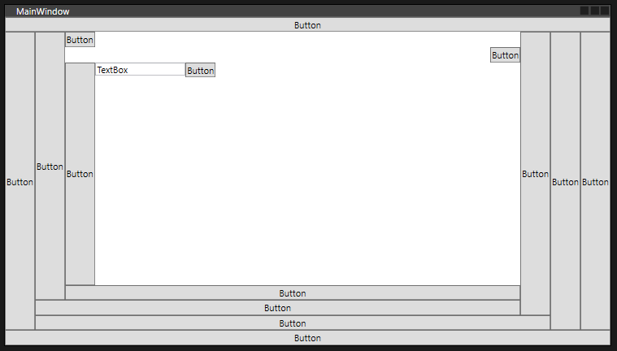

## Dock Panel



```xml
    <DockPanel LastChildFill="True">
        <Button Content="Button" Width="Auto" DockPanel.Dock="Top"/>
        <Button Content="Button" Width="Auto" DockPanel.Dock="Bottom"/>
        <Button Content="Button" Width="Auto" DockPanel.Dock="Left"/>
        <Button Content="Button" Width="Auto" DockPanel.Dock="Right"/>
        <Button Content="Button" Width="Auto" DockPanel.Dock="Right"/>
        <Button Content="Button" Width="Auto" DockPanel.Dock="Bottom"/>
        <Button Content="Button" Width="Auto" DockPanel.Dock="Right"/>
        <Button Content="Button" Width="Auto" DockPanel.Dock="Bottom"/>
        <Button Content="Button" Width="Auto" DockPanel.Dock="Left"/>
        <Button Content="Button" Width="Auto" DockPanel.Dock="Bottom"/>
        <Button Content="Button" Width="Auto" DockPanel.Dock="Top" HorizontalAlignment="Left"/>
        <Button Content="Button" Width="Auto" DockPanel.Dock="Top" HorizontalAlignment="Right"/>
        <Button Content="Button" Width="Auto" DockPanel.Dock="Left"/>
        <StackPanel Orientation="Horizontal">
            <TextBox TextWrapping="Wrap" Text="TextBox" Width="120" VerticalAlignment="Top"/>
            <Button Content="Button" Width="Auto" DockPanel.Dock="Left" VerticalAlignment="Top"/>
        </StackPanel>
    </DockPanel>
```