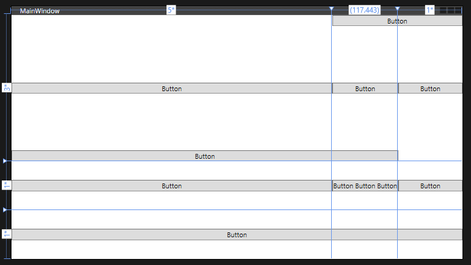

## Grid Control



```xml
    <Grid>
        <Grid.ColumnDefinitions>
            <ColumnDefinition Width="5*"/>
            <ColumnDefinition Width="auto"/>
            <ColumnDefinition Width="*"/>
        </Grid.ColumnDefinitions>
        <Grid.RowDefinitions>
            <RowDefinition Height="3*" />
            <RowDefinition Height="*" />
            <RowDefinition Height="*" />
        </Grid.RowDefinitions>
        <Button Content="Button" VerticalAlignment="Center" Width="Auto"/>
        <Button Content="Button" Grid.ColumnSpan="2" VerticalAlignment="Bottom" Width="Auto"/>
        <Button Content="Button" Grid.Column="1" VerticalAlignment="Center" Width="Auto"/>
        <Button Content="Button" Grid.Row="1" VerticalAlignment="Center" Width="Auto"/>
        <Button Content="Button Button Button" Grid.Row="1" Grid.Column="1" VerticalAlignment="Center" Width="Auto"/>
        <Button Content="Button" Grid.Column="2" VerticalAlignment="Center" Width="Auto"/>
        <Button Content="Button" Grid.Column="1" Grid.ColumnSpan="2" VerticalAlignment="Top" Width="Auto"/>
        <Button Content="Button" Grid.Row="1" Grid.Column="2" VerticalAlignment="Center" Width="Auto"/>
        <Button Content="Button" Grid.Row="2" Grid.ColumnSpan="3" VerticalAlignment="Center" Width="Auto"/>
    </Grid>
```