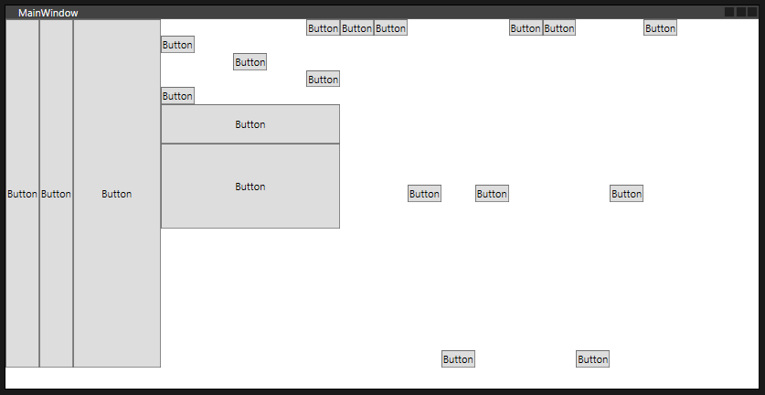

## Stack Panel



```xml
    <StackPanel Margin="0,0,65,25" Orientation="Horizontal">
        <Button Content="Button"/>
        <Button Content="Button"/>
        <Button Content="Button" Width="103"/>
        <StackPanel Width="211" Orientation="Vertical">
            <Button Content="Button" HorizontalAlignment="Right"/>
            <Button Content="Button" HorizontalAlignment="Left"/>
            <Button Content="Button" HorizontalAlignment="Center"/>
            <Button Content="Button" HorizontalAlignment="Right"/>
            <Button Content="Button" HorizontalAlignment="left"/>
            <Button Content="Button" Height="46"/>
            <Button Content="Button" Height="100" />
        </StackPanel>
        <StackPanel Width="406" Orientation="Horizontal">
            <Button Content="Button" VerticalAlignment="Top"/>
            <Button Content="Button" VerticalAlignment="Top"/>
            <Button Content="Button" VerticalAlignment="Center"/>
            <Button Content="Button" VerticalAlignment="Bottom"/>
            <Button Content="Button" VerticalAlignment="Center"/>
            <Button Content="Button" VerticalAlignment="Top"/>
            <Button Content="Button" VerticalAlignment="Top"/>
            <Button Content="Button" VerticalAlignment="Bottom"/>
            <Button Content="Button" VerticalAlignment="Center"/>
            <Button Content="Button" VerticalAlignment="Top"/>
        </StackPanel>
    </StackPanel>

```