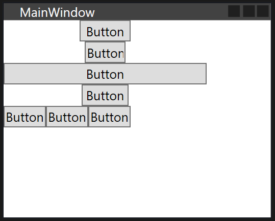

## Wrap Panel



```xml
    <WrapPanel Margin="0,0,21,35" Orientation="Vertical">
        <Button Content="Button" Width="48" Margin="10, 0, 10, 0"/>
        <Button Content="Button" Width="38" Margin="10, 0, 10, 0"/>
        <Button Content="Button"/>
        <Button Content="Button" Width="44"/>
        <WrapPanel Height="55" Width="190" Orientation="Horizontal">
            <Button Content="Button"/>
            <Button Content="Button"/>
            <Button Content="Button"/>
        </WrapPanel>
    </WrapPanel>
```